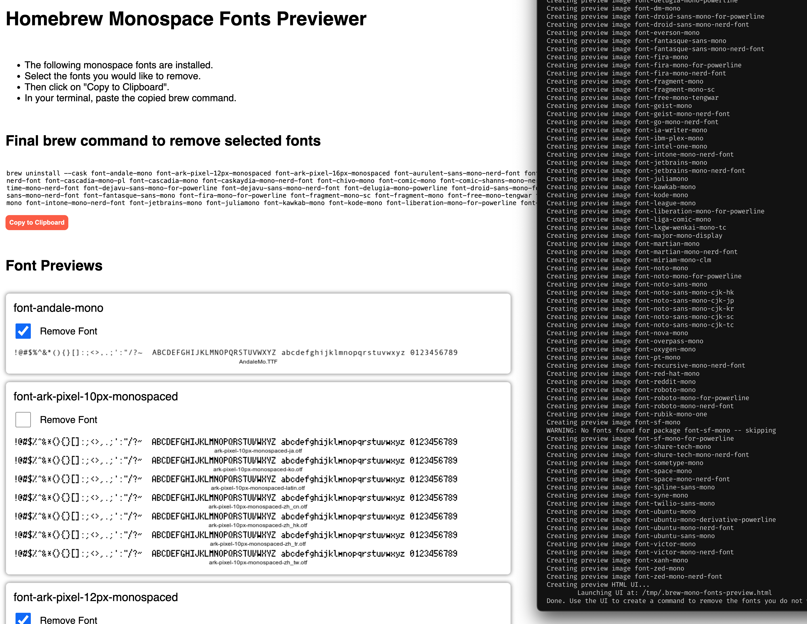

# Homebrew Monospaced Fonts Previewer

This is a BASH script that generates previews of all monospaced fonts available on Homebrew.

A HTML UI is created to show you the previews.

Select fonts to uninstall and copy the CLI to do so.

That's it!

